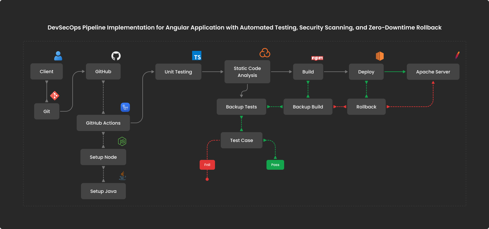

# DevSecOps CI/CD Pipeline for Angular PWA with Automated Testing, Security Scanning, and Zero-Downtime Rollback

This project is a **Progressive Web Application (PWA)** built using **Angular**. It includes a fully automated **DevSecOps pipeline** implemented using **GitHub Actions**, integrating key stages such as build, test, code analysis, deployment, and rollback.

## Project Structure

```

sample-pwa/
├── src/ # Angular source code
├── dist/ # Compiled output
├── .github/workflows/ # GitHub Actions workflows
│ └── deploy.yml # Main CI/CD pipeline
├── angular.json
├── package.json
├── README.md
└── ...

```

## Tech Stack

| Layer        | Technology              |
| ------------ | ----------------------- |
| Frontend     | Angular                 |
| CI/CD        | GitHub Actions          |
| Code Quality | SonarQube               |
| Deployment   | AWS EC2 (Apache server) |
| Scripting    | Bash, SSH               |

---

## CI/CD Workflow Overview

The pipeline (defined in `.github/workflows/deploy.yml`) performs the following steps:

1. **Trigger**: On every push to the `main` branch.
2. **Checkout**: Pulls the latest code from GitHub.
3. **Setup**:
   - Node.js 16 for Angular
   - Java 17 for SonarQube
4. **Install Dependencies**: Runs `npm install`
5. **Unit Testing**: Uses headless Chrome to run Angular tests
6. **Static Code Analysis**: Integrates with SonarQube
7. **Build**: Executes `ng build --prod` to generate production-ready code
8. **Backup & Deploy**:
   - SSHs into the EC2 instance
   - Backs up current app
   - Uploads and extracts new build
   - Restarts Apache
9. **Rollback**: Reverts to backup if deployment fails

## Deployment Target

- **Server**: AWS EC2 (Linux)
- **Web Server**: Apache
- **Path**: `/var/www/html/`

---

## Secrets Required

Ensure the following GitHub Secrets are configured:

| Secret Name         | Purpose                         |
| ------------------- | ------------------------------- |
| `EC2_HOST`          | Public DNS of the EC2 instance  |
| `EC2_USERNAME`      | SSH user (e.g., `ec2-user`)     |
| `EC2_SSH_KEY`       | SSH private key for EC2 access  |
| `SONAR_TOKEN`       | SonarQube authentication token  |
| `SONAR_HOST_URL`    | URL of your SonarQube server    |
| `SONAR_PROJECT_KEY` | Unique project key for analysis |

---

## To Run Locally

```bash
# Install dependencies
npm install

# Run tests
npm test

# Build project
ng build --prod

# Serve locally
npx http-server ./dist/sample-pwa
```

## CI/CD Architecture



## Rollback Strategy

If the deployment fails at any stage:

- The pipeline automatically restores the last working backup on the EC2 instance.
- This ensures zero downtime and high availability.

## Contributions

Feel free to fork this repository and submit a PR for any enhancements or issues.

## License

This project is licensed under the [MIT License](LICENSE).
